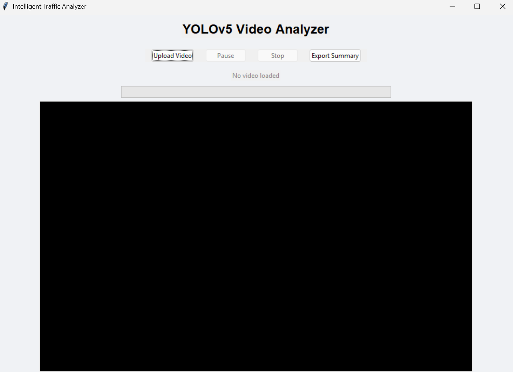
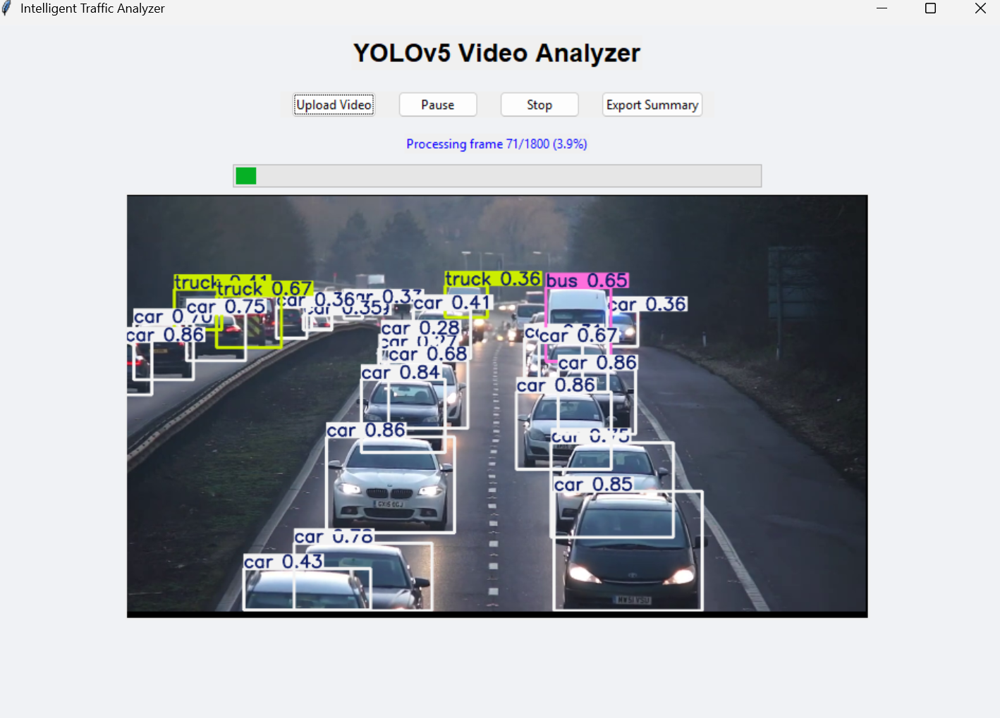
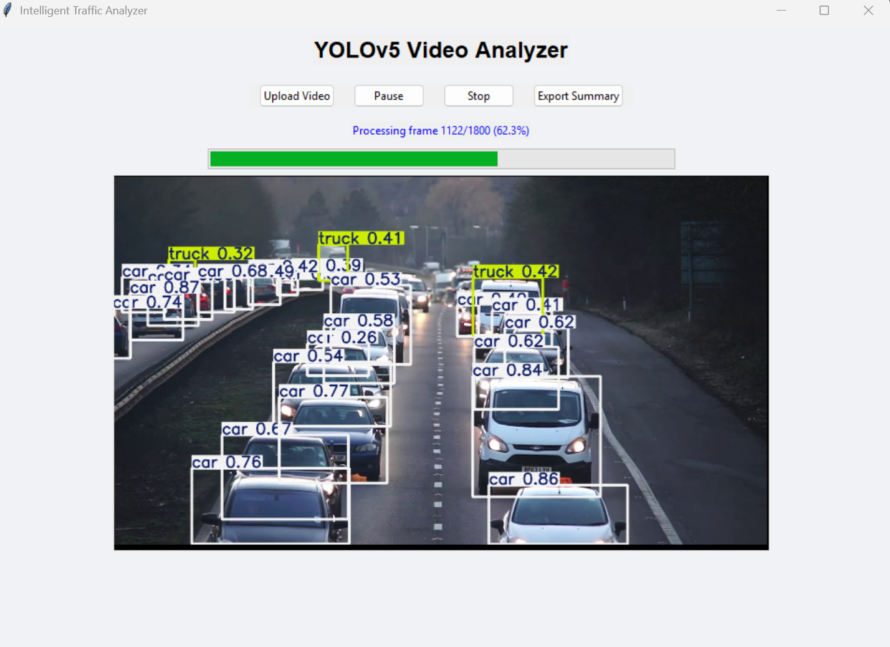
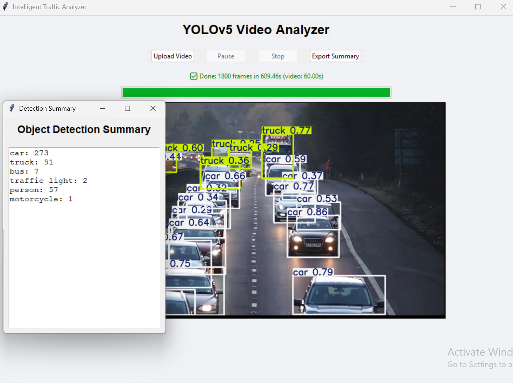

# 🚦 Real-Time Traffic Monitoring with YOLOv5 and Tkinter

A desktop-based real-time traffic monitoring application that uses **YOLOv5s** for efficient vehicle detection. Built using **Tkinter**, **OpenCV**, and **Ultralytics YOLO**, this tool is lightweight and optimized for machines with limited resources.

---

## ✨ Features

- Real-time object detection using YOLOv5s
- Intuitive GUI built with Tkinter
- Pause and resume video analysis
- Cancel/stop processing anytime
- Automatically shows a summary of detected vehicle classes
- Export detection results to CSV format
- Designed for use with recorded video files

---

## 🧱 Project Structure

├── main.py # Entry point (initializes the app)
├── gui.py # GUI layout and event handlers
├── logic.py # Video processing logic (YOLO + OpenCV)
├── summary.py # Detection summary popup window
├── export.py # Export summary to CSV
├── utils.py # Utility functions (IoU, detection logic)
├── yolov5s.pt # Pre-trained model weights
└── requirements.txt # Python dependencies

---

## 🚀 Getting Started

### 1. Install dependencies

```bash
pip install -r requirements.txt
from ultralytics import YOLO
model = YOLO("yolov5s.pt")
python main.py

Video Requirements
The app currently supports video file input only (e.g., .mp4, .avi, .mkv).

You can browse and upload a video through the GUI.

Notes
The GUI is built with Tkinter, so it runs cross-platform on Windows, macOS, and Linux.

You do not need to clone the YOLOv5 repository — the Ultralytics package handles model loading directly.

Technologies Used
Python 3.8+

Tkinter – GUI framework

OpenCV – For frame capture and video handling

Ultralytics YOLO – Object detection

## 📸 Screenshots

### GUI Interface


### After Uploading Video


### Prediction in Progress


### Final Result Summary

